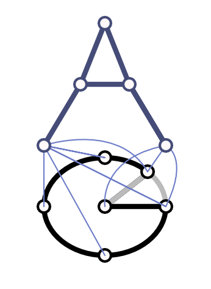

  

# abstractgraph-graphicalizer

`abstractgraph-graphicalizer` is the ingestion layer of the AbstractGraph
ecosystem.

It converts raw, structured, or weakly structured domain data into labeled
NetworkX graphs. Those graphs can then be used directly or handed to
`abstractgraph` for decomposition, vectorization, learning, and generation.

For package layout, local setup, validation commands, and documentation index,
see [docs/ORGANIZATION.md](docs/ORGANIZATION.md).

## Semantic Role

This package answers the first graph question: what is the graph implied by the
original object?

It focuses on identifying entities, relations, and attributes before any
downstream abstract graph operators are applied. It does not own decomposition,
hashing, model training, or generation. Its job is to make different domains
speak a common attributed-graph language.

## Converter Families

### Graph Interpretation Bottleneck

The bottleneck backend learns sparse reusable graph structure from transformer
or token embeddings through self-supervised masked reconstruction. It is the
preferred learned graphicalization path for weakly structured token, patch,
sequence, or multimodal embedding inputs.

See [docs/BOTTLENECK.md](docs/BOTTLENECK.md).

### Attention Graphicalizers

The attention backend turns token-level numeric inputs into preimage graphs by
learning token embeddings and extracting robust co-clustering structure from
attention patterns. It remains available for compatibility and lightweight
attention-derived graph extraction.

See [docs/ATTENTION.md](docs/ATTENTION.md).

### Chemistry Graphicalizers

The chemistry backend turns molecular representations into labeled graphs with
atoms as nodes and bonds as edges. It supports small-molecule preprocessing,
cheminformatics workflows, molecular visualization, and compatible conversion
back into RDKit molecules.

See [docs/CHEMISTRY.md](docs/CHEMISTRY.md).

### Graph Graphicalizers

The graph backend provides lightweight converters and graph enrichers for data
that is already sequence-like, vector-like, or graph-like. It is useful when
the input already has a clear combinatorial or geometric interpretation.

See [docs/GRAPH.md](docs/GRAPH.md).

### Data Graphicalizers

The data backend turns tabular or matrix-valued numeric data into feature
graphs. It can build feature-dependency graphs directly or instantiate
sample-specific graphs from a learned correlation template.

See [docs/DATA.md](docs/DATA.md).

### RNA Graphicalizers

The RNA backend converts sequence and structure information into graphs whose
nodes are nucleotides and whose edges capture backbone connectivity, base-pair
links, or reverse-complement interactions.

See [docs/RNA.md](docs/RNA.md).

### Protein Graphicalizers

The protein backend converts protein chains into protein contact networks with
residues represented by C-alpha coordinates.

See [docs/PROTEIN.md](docs/PROTEIN.md).

### Image Graphicalizers

The image backend builds scene graphs from images plus precomputed segment
descriptions. It focuses on graph construction, visualization, and loading
utilities around segmented image inputs.

See [docs/IMAGE.md](docs/IMAGE.md).

## Ecosystem

See the [AbstractGraph ecosystem README](../../README.md) for how this
repository fits with the sibling repositories.
